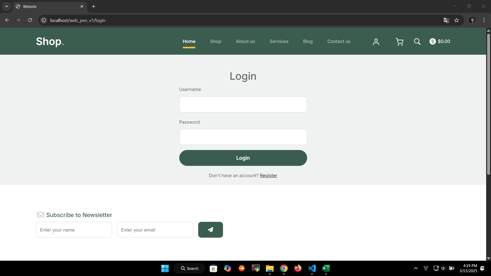
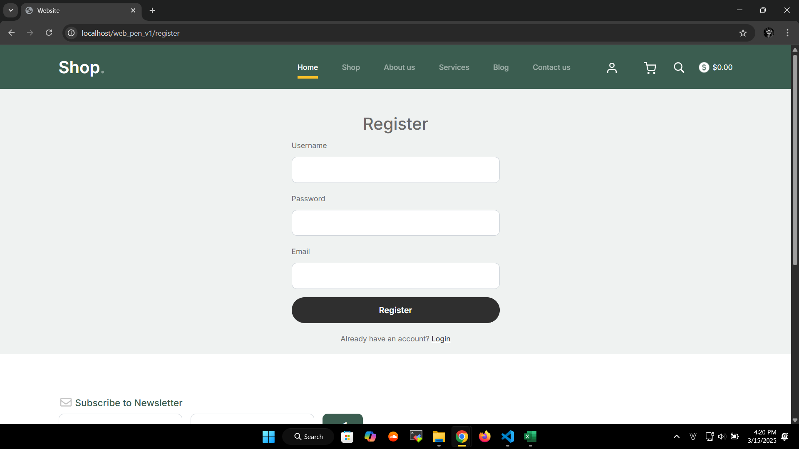
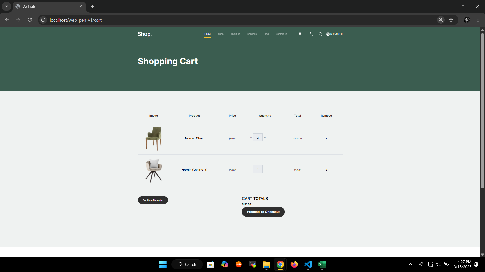
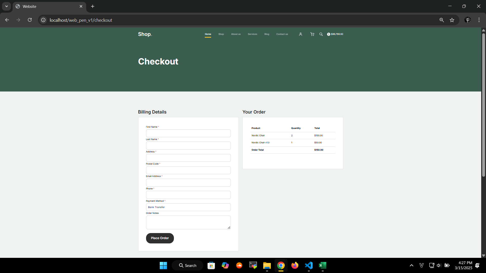
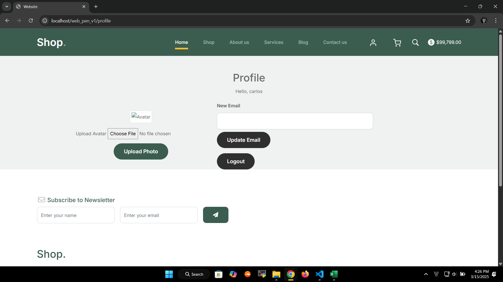

# Pentest Website - OWASP Top 10  

## 1. Giới thiệu  

### Mô tả  
Đây là project về Pentest cơ bản, tập trung vào việc xây dựng một website có chứa lỗ hổng bảo mật và tiến hành khai thác, sau đó đưa ra giải pháp khắc phục.  

### Mục tiêu  
- Xây dựng website có chứa 5 lỗ hổng thuộc **OWASP Top 10 (2021)**.  
- Khai thác và kiểm thử các lỗ hổng.  
- Đề xuất giải pháp khắc phục.  
- Triển khai website trên một máy chủ thực tế (Linux, Ubuntu, Windows).  

### Cách tiếp cận  
Phương pháp kiểm thử bảo mật được sử dụng trong project này là **Whitebox Pentesting**, nghĩa là:  
- Có quyền truy cập mã nguồn và hệ thống.  
- Kiểm thử từ góc nhìn của developer.  
- Chủ động tạo và khai thác lỗ hổng trong mã nguồn.  

---

## 2. Các chức năng chính  
Website được xây dựng theo mô hình **MVC (Model-View-Controller)** và có các chức năng chính như:  
- ✅ Đăng nhập  
- ✅ Định danh, xác thực người dùng  
- ✅ Phân quyền người dùng  
- ✅ Quản lý bài viết, bình luận, hệ thống giỏ hàng và tiền tệ  
- ✅ Hỗ trợ upload file  
- ✅ Triển khai trên máy chủ  

# Giao diện Website

### 🔹 Giao diện chính

| Login | Register | Shop |
|---|---|---|
|  |  |  |

| Cart | Checkout | Profile |
|---|---|---|
|  |  |  |

---

<details>
  <summary>📸 Xem thêm ảnh giao diện phụ</summary>

  | Comment |  Blog |
  |---|---|
  |  |  |

</details>

---

## 3. Thống kê lỗ hổng OWASP Top 10 (2021)

| STT | Lỗ hổng | Mô tả | Vị trí | Mức độ |
|---|---|---|---|---|
| **1** | **A03:2021 - Injection (SQLi)** | SQL Injection trong truy vấn đăng nhập. | `/login.php` | 🔴 Cao |
| **2** | **A01:2021 - Broken Access Control** | Xóa user không xác thực quyền admin. | `/profile/updateEmail` | 🔴 Cao |
| **3** | **A08:2021 - Software and Data Integrity Failures (RCE)** | Upload file `.php` gây RCE. | `/profile/uploadAvatar` | 🔴 Cao |
| **4** | **A03:2021 - Injection (Stored XSS)** | Stored XSS trong bình luận blog do không lọc input. | `/blog_detail.php` | 🟠 Trung bình |
| **5** | **A05:2021 - Security Misconfiguration** | Truy cập file backup `git_old`, lộ thông tin. | `/backup/git_old` | 🟠 Trung bình |


---

## 4. Khai thác lỗ hổng  
<details>
  <summary>🛑 A03:2021 - Injection (SQLi) - Bypass Đăng Nhập</summary>

## 🔥 Tầm Quan Trọng Của Phát Hiện Chính
- **Mức độ**: 🔴 Cao  
- **Ảnh hưởng**: Cho phép bypass xác thực password, truy cập tài khoản nếu biết username hợp lệ.  
- **Hệ lụy**:  
  - Tấn công viên có thể đăng nhập vào tài khoản bất kỳ mà không cần mật khẩu đúng.  
  - Có thể leo thang đặc quyền nếu truy cập vào tài khoản admin.  
  - Tiềm năng khai thác sâu hơn nếu kết hợp với các kỹ thuật SQLi khác (ví dụ: UNION).  

---

## 📌 Phát Hiện Chung
- Truy vấn SQL tại **`/login.php`** không lọc đầu vào của biến `$username`.  
- Cho phép thực hiện **SQL Injection** bằng cách chèn ký tự `#` để comment bỏ điều kiện password.  
- Payload `carlos'#` (với `carlos` là username thật) bỏ qua kiểm tra password, cho phép login mà không cần mật khẩu đúng.  
- Payload `' OR 1=1 --` ` -- ` không hoạt động do xử lý lỗi trong `Database.php`.  

---

## 🛠 PoC - Bằng Chứng Khai Thác
📌 1. Payload Tấn Công:
--------------------------------
Username: carlos'#
Password: (bất kỳ)

🖥 2. Request Gửi Đến Server:
--------------------------------
POST /login.php HTTP/1.1
Host: target-site.com
Content-Type: application/x-www-form-urlencoded

username=carlos'%23&password=randompassword

🛠 3. Truy Vấn SQL Bị Thao Túng:
--------------------------------
SELECT * FROM users WHERE username = 'carlos'#' AND password = 'randompassword';

✅ 4. Response Thành Công:
--------------------------------
HTTP/1.1 302 Found
Location: /home.php

🚨 5. Ảnh Chụp Màn Hình:
--------------------------------
 


## 🔧 Biện Pháp Khắc Phục Được Đề Xuất
Sử dụng Prepared Statement (PDO / MySQLi) để bind tham số:
```php
$stmt = $pdo->prepare("SELECT * FROM users WHERE username = ? AND password = ?");
$stmt->execute([$username, $password]);
$user = $stmt->fetch();
```
- Không sử dụng truy vấn SQL với chuỗi nối trực tiếp từ input người dùng.
- Bật chế độ báo lỗi và log lỗi thay vì hiển thị lỗi SQL ra ngoài.
- Bổ sung hash password bằng password_hash() trong Register.php và verify bằng password_verify() trong Login.php.
</details> 


